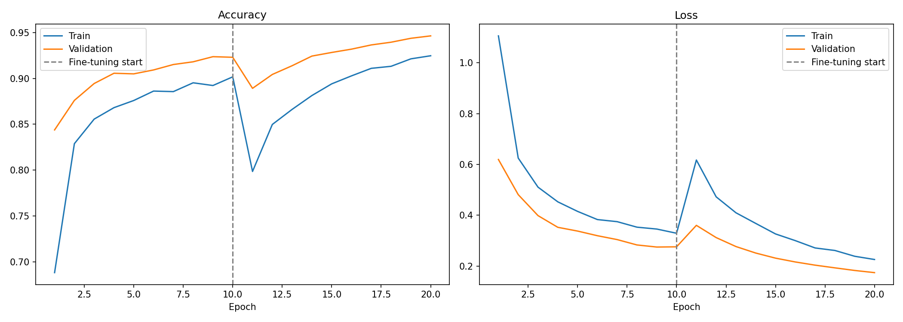
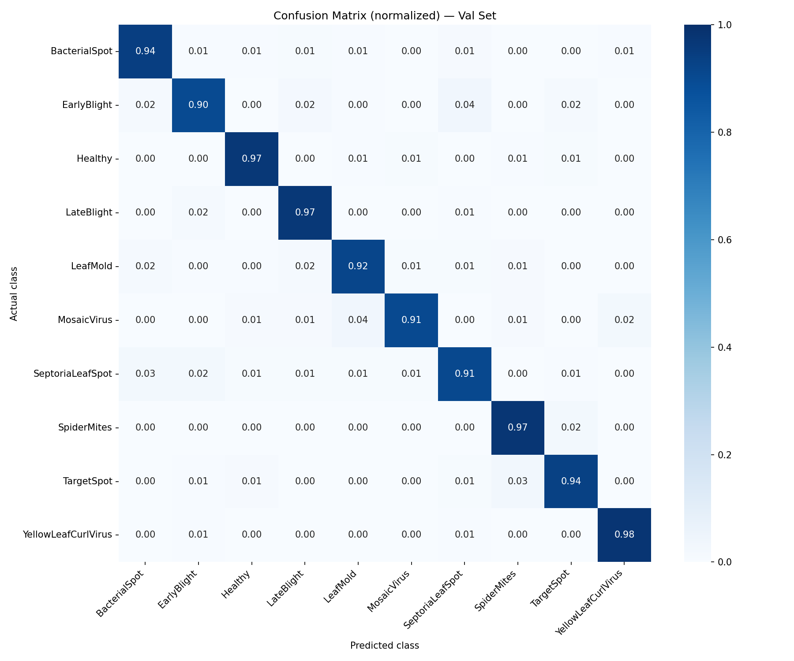
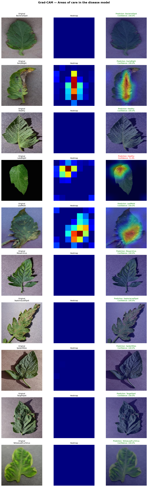

# 🍃 Leaf Diseases Classification – Computer Vision Project

## 🧠 Description
The purpose of this project is to develop a predictive computer vision model capable of identifying diseases from tomato leaf images.

The model was trained using image classification techniques and deep learning frameworks to recognize different disease categories from tomato leaf samples.

Projects like this can support the agricultural sector by helping detect plant diseases at early stages, preventing them from spreading to healthy crops, and promoting sustainable tomato production.

---

## ⚙️ Technologies Used
- Python  
- OS  
- JSON  
- Pandas  
- NumPy  
- Matplotlib  
- Scikit-learn  
- TensorFlow  
- Keras  
- Jupyter Notebook  

---

## 🚀 How to Run

1. Clone this repository:
   ```bash
   git clone https://github.com/jpcampos04/2605_leaf_diseases_cv.git
   pip install pandas numpy matplotlib scikit-learn tensorflow keras
   jupyter notebook 2605_leaf_diseases_cv.ipynb
   ```

## Results

### Training Curves


### Confusion Matrix


### Grad-CAM Visualizations
